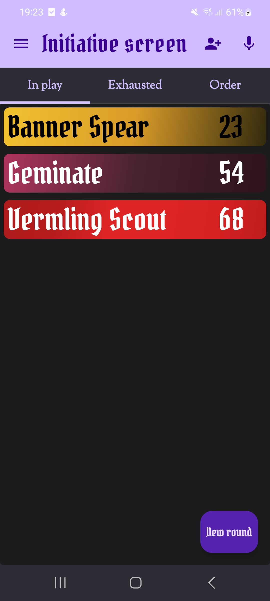
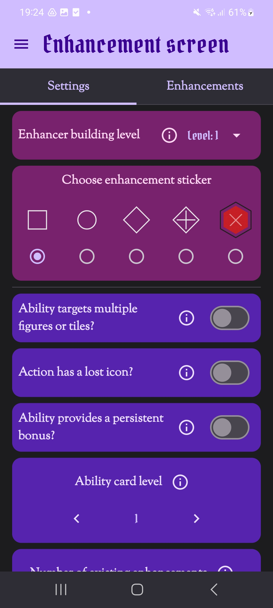

# Frosthaven/Gloomhaven Initiative Tracker & Enhancement Cost Calculator

Welcome to the ultimate tool designed to streamline and enhance your Frosthaven/Gloomhaven gaming experience!

## 🚀 Features

### 1️⃣ Initiative Tracker
   - 🖊️ **Manual Input**: Easily input the name and initiative of characters.
   - 🎤 **Voice Commands**: Update the initiative order via voice commands.
   - 🔖 **Preset Order**: Use a predetermined order for every characters initiative.

### 2️⃣ Enhancement Cost Calculator
   - 🧮 Easily determine the enhancement costs by following the game's rules.

## 🛑 Important: Assets

**Due to copyright restrictions, I do not provide drawable assets for characters.** You'll need to supply your own.

## 📝 Usage

### 1️⃣ Assets
- Place your drawable assets for characters in the specified folder.

### 2️⃣ Launch
- Run the application and follow the on-screen prompts. Choose between manual input, voice commands, or preset order for initiative tracking.

### 3️⃣ Enhancement Cost Calculator
- Enter the required details to get the calculated enhancement cost.

## 🙏

Enjoy your game and may your adventures be legendary!
